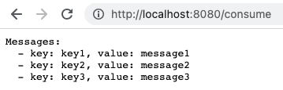

# Java Experiments

Simple Java application (Spring Boot based) for experiments.

# Build and start

Maven:

```shell
make maven-build
make maven-start
```

Gradle:

```shell
make gradle-build
make gradle-start
```

# Kafka Producer


# Kafka Consumer


